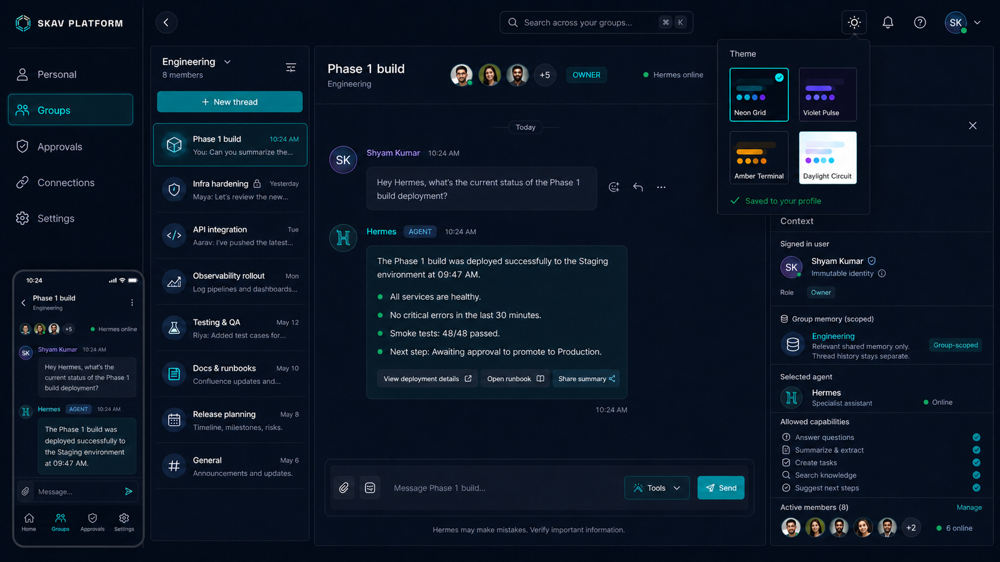

# Skavan UI design system

Status: **Approved and locked for V1**  
Approved reference: authenticated workspace prototype agreed on 2026-08-21.

## Visual reference

The repository copy above is the canonical V1 visual reference. Its checksum and
review guidance are recorded in `docs/ui/mockups/README.md`. The written rules in
this document govern interaction, responsive behavior, accessibility, security
language, and details that cannot be inferred reliably from a static image.

## Product shell

The authenticated application uses a responsive, context-first workspace:

1. Primary navigation: Personal, Groups, Approvals, Connections, Settings.
2. Workspace navigation: selected group and its independent threads.
3. Main content: the active collaborative Hermes conversation.
4. Context panel: signed-in platform user, group role, group-scoped memory,
   selected agent, allowed capabilities, and active members.

Desktop may display all four regions. Tablet collapses the context panel into a
drawer. Mobile uses one content region at a time with bottom primary navigation;
thread and context regions become sheets/drawers. No desktop-only workflow is
permitted.

## Brand contract

The canonical SKAV mark is the geometric wireframe hexagonal cube shown in the
approved workspace reference. Use `apps/web/public/skav-mark.svg` as the source
asset. Do not substitute a glowing dot, letter avatar, generic cube icon, or a
newly improvised mark beside the `SKAV PLATFORM` wordmark. Product avatars and
status indicators are separate components and must not be presented as the
brand mark.

## Theme contract

The supported V1 themes are exactly:

| Preference value | Display name | Mode |
| --- | --- | --- |
| `neon-grid` | Neon Grid | Dark cyan |
| `violet-pulse` | Violet Pulse | Dark violet |
| `amber-terminal` | Amber Terminal | Dark amber |
| `daylight-circuit` | Daylight Circuit | Light |

The canonical token definitions live in `apps/web/app/themes.css`. Components
must use semantic `--color-*` and `--shadow-*` tokens. A component must not
branch on a theme name or introduce theme-specific colour literals.

Reusable surface, brand, tab, form, action, theme-picker, and responsive auth
patterns live in `apps/web/app/ui-patterns.css`. New pages must compose these
patterns before adding page-specific CSS. The approved interactive auth
reference is `docs/ui/prototypes/login-registration-v1.html`.

Theme choice belongs in `users.preferences.theme`. The server supplies the saved
preference at session bootstrap, the root `<html data-theme>` receives it before
interactive rendering, and a change is persisted through the platform API. The
fallback is `neon-grid`. This prevents a flash of the wrong theme and keeps the
choice consistent across browsers and future mobile clients.

## Context and security language

- Show the canonical platform user and effective group role, not email as identity.
- Label memory as **Group memory (scoped)**.
- Use the copy: **Relevant shared memory only. Thread history stays separate.**
- Display only capabilities effective for the current user and group.
- Never imply that every transcript is automatically shared or that UI hiding is
  authorization. The backend remains authoritative.

## Component rules

- Reuse shared primitives for buttons, inputs, panels, badges, avatars, menus,
  dialogs, drawers, empty states, loading states, and errors.
- Minimum interactive target: 44 by 44 CSS pixels on touch layouts.
- Keyboard focus must be visible using the active accent token.
- Do not communicate status by colour alone; pair it with text or an icon.
- Text and controls must meet WCAG 2.2 AA contrast in all four themes.
- Use a consistent 4/8 pixel spacing rhythm and restrained radii (10–18 pixels).
- Use sans-serif for content and monospace only for metadata, status, IDs, and
  technical labels.
- Every data surface must define loading, empty, error, unauthorized, and offline
  states before it is considered complete.

## Change control

The shell, theme names, semantic token model, responsive behavior, and context
language above are V1 design constraints. Material changes require updating this
document and explicit product approval. New UI work should be reviewed against
this document before merge.
